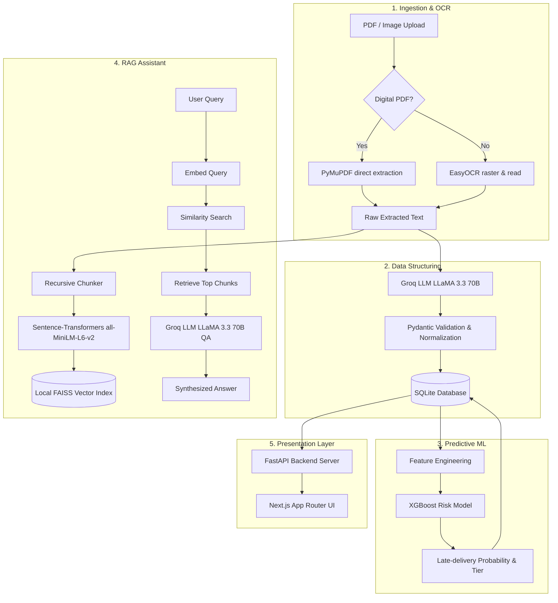

# SupplyMind

SupplyMind is an AI-powered procurement and vendor risk intelligence platform. It automates document ingestion, extracts structured contract data, analyzes late-delivery vendor risk using machine learning, and provides a Retrieval-Augmented Generation (RAG) assistant for querying procurement documents.

---

## 🏗️ Architecture & Core Engines

SupplyMind is designed around a modular architecture that combines traditional machine learning with state-of-the-art Generative AI.



### 1. Document Ingestion & OCR Engine
- **Direct Layout Extraction:** Uses `PyMuPDF` to parse text from digital PDFs instantaneously and with perfect fidelity.
- **OCR Fallback:** Uses `EasyOCR` to rasterize and perform optical character recognition on scanned PDFs or image uploads (`.png`, `.jpg`, etc.).
- **Auto-Detection:** Analyzes character density per page to automatically determine the extraction method.

### 2. Information Extraction Engine
- **Entity Extraction:** Uses `llama-3.3-70b-versatile` via the Groq API to extract structured fields (GSTIN, PAN, items, contract duration, payment terms) from messy OCR output.
- **Normalization:** Validates extracted values using Pydantic, standardizes currency formats, and normalizes dates.

### 3. Machine Learning Risk Predictor
- **Algorithm:** Scikit-learn preprocessor pipeline paired with an `XGBoost` classifier.
- **Objective:** Evaluates shipping modes, scheduled delivery days, order quantities, and vendor history to predict late-delivery probabilities.
- **Risk Tiers:** Classifies vendor risk as:
  - `low` (0.00 – 0.30)
  - `medium` (0.30 – 0.55)
  - `high` (0.55 – 0.80)
  - `critical` (0.80 – 1.00)

### 4. RAG AI Assistant
- **Local Embedding:** Sentence-Transformers `all-MiniLM-L6-v2` embeds document chunks locally (384 dimensions).
- **Vector Index:** `FAISS` library saves vector indices to local disk files for fast similarity retrieval.
- **Question-Answering:** Retrieves context-relevant chunks and queries Groq to synthesize accurate answers grounded in uploaded documents.

---

## 📁 Project Structure

```
SupplyMind/
├── backend/
│   ├── app/
│   │   ├── config.py         # App configuration & env mapping
│   │   ├── database.py       # SQLAlchemy engine & SQLite config
│   │   ├── main.py           # FastAPI server initialization
│   │   ├── models.py         # SQLite database models
│   │   ├── schemas.py        # Pydantic schemas for request/response validation
│   │   ├── routers/          # API route controllers
│   │   │   ├── analytics.py
│   │   │   ├── documents.py
│   │   │   ├── health.py
│   │   │   ├── rag.py
│   │   │   └── vendors.py
│   │   └── services/         # Logical service modules
│   │       ├── analytics_service.py
│   │       ├── extraction_service.py
│   │       ├── ocr_service.py
│   │       ├── rag_service.py
│   │       └── risk_service.py
│   └── requirements.txt      # Python package dependencies
├── frontend/
│   ├── app/                  # Next.js App Router (dashboard, rag, vendors, documents)
│   ├── components/           # Modular UI widgets (sidebar, status badges, uploaders)
│   ├── lib/                  # Fetch clients & format utilities
│   ├── globals.css           # Tailwind CSS directives
│   └── package.json          # Node.js dependencies & scripts
├── ml/
│   ├── models/               # Serialized preprocessors and model binaries
│   ├── feature_engineering.py# Features transformation pipeline
│   ├── predict.py            # Model inference class wrapper
│   └── train_risk_model.py   # Training script using DataCo datasets
├── scripts/                  # Diagnostics, test runners, & seed scripts
│   ├── create_test_documents.py
│   ├── generate_training_data.py
│   ├── model_diagnostics.py
│   ├── test_extraction.py
│   ├── test_ocr.py
│   ├── test_prediction.py
│   ├── test_risk_api.py
│   └── test_upload_api.py
└── data/                     # Local file data storage (SQLite DB, Uploads, FAISS Indexes)
```

---

## 🚀 Getting Started

### Prerequisites
- **Python:** 3.10+
- **Node.js:** 18+ (tested on Node 20)

### 1. Environment Variables Configuration
Create a `.env` file in the root workspace directory:
```env
GROQ_API_KEY=your_groq_api_key_here
# Optional configuration variables:
# DATABASE_URL=sqlite:///data/supplymind.db
# UPLOAD_DIR=data/uploads
# FAISS_INDEX_DIR=data/faiss_index
```

### 2. Backend Setup
1. Open a terminal and navigate to the project root:
   ```powershell
   # Create a virtual environment
   python -m venv venv
   
   # Activate it
   venv\Scripts\Activate.ps1   # Windows
   source venv/bin/activate    # macOS/Linux
   
   # Install dependencies
   pip install -r backend/requirements.txt
   ```
2. Start the FastAPI backend server:
   ```powershell
   python -m uvicorn backend.app.main:app --host 127.0.0.1 --port 8000
   ```
   *The backend will automatically create the local database (`data/supplymind.db`) and structure tables on startup.*

### 3. Frontend Setup
1. Open a new terminal in `frontend/`:
   ```powershell
   cd frontend
   npm install
   ```
2. Start the Next.js development server:
   ```powershell
   npm run dev
   ```
3. Open your browser and navigate to `http://127.0.0.1:3000`.

---

## 📊 Model Training & Diagnostics

If you want to re-train the ML late-delivery risk model or run test scripts, run these commands from the project root:

| Command | Purpose |
| :--- | :--- |
| `python scripts/generate_training_data.py` | Generates a synthesized dataset representing shipment logistics features. |
| `python ml/train_risk_model.py` | Trains the preprocessor & XGBoost model, saving files under `ml/models/`. |
| `python scripts/model_diagnostics.py` | Evaluates accuracy, F1-scores, feature importance, and logs model stats. |
| `python scripts/test_ocr.py` | Runs direct PyMuPDF text extraction or raster EasyOCR to test document reading. |
| `python scripts/test_extraction.py` | Tests extracting structured JSON properties from target text pages using Groq. |
| `python scripts/test_risk_api.py` | Performs integration test calls against the risk endpoint. |

---

## 📡 Backend APIs

The FastAPI server provides local Swagger documentation at `http://127.0.0.1:8000/api/v1/docs`.

### Key Routes
- **Health:** `GET /api/v1/health` — Checks status of API services, Database connection, and ML Model availability.
- **Documents:**
  - `POST /api/v1/documents/upload` — Ingests a new document file.
  - `GET /api/v1/documents` — Fetches a list of processed documents.
- **Vendors:** `GET /api/v1/vendors` — Lists vendors, contract statistics, and overall risk scores.
- **RAG QA:**
  - `POST /api/v1/rag/index` — Indexes uploaded document contents into FAISS.
  - `POST /api/v1/rag/ask` — Evaluates queries using vector search and generates responses.
- **Analytics:** `GET /api/v1/analytics/summary` — Compiles aggregate KPIs (Total Spend, OCR Rate, Risk Distribution).
